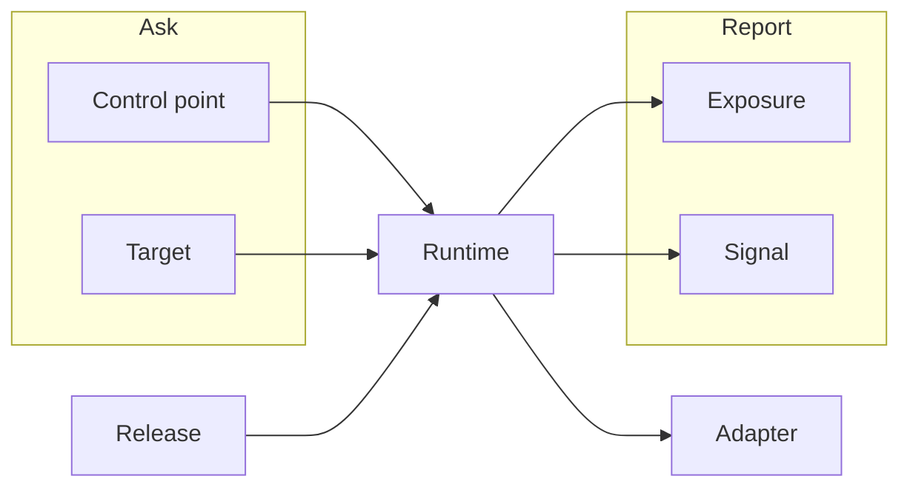

FireWeave SDKs evaluate **control points**, optionally register **targets**, bind a **release**, and record **exposures** and **signals**. A **runtime** owns lifecycle and talks to fw-server through an **adapter**. Ask **capabilities** what this build can do instead of sniffing versions.

This page is the map. Each child page answers what the concept is, why it exists, when to use it, how it relates to the others, and what it looks like in code.

<Note>
  OpenFeature and the wire still say `flagKey`. The product name is **control point** ([ADR-0007](https://github.com/FireWeave-HQ/fireweave-sdk/blob/master/docs/adr/0007-control-point-vocabulary.md)). Do not invent `controlPointKey`.
</Note>

## Concept map

<Columns cols={2}>
  <Card title="Control points" href="/concepts/control-points">
    The named decision your code asks FireWeave for. Evaluation uses the parameter `flagKey`.
  </Card>
  <Card title="Targeting" href="/concepts/targeting">
    Who the decision is for: `targetingKey`, properties, and registration where the API exists.
  </Card>
  <Card title="Releases" href="/concepts/releases">
    Bind this process to a rollout, then `start`, `complete`, or `fail`.
  </Card>
  <Card title="Exposures" href="/concepts/exposures">
    Proof a target saw a decision. Opt-in — `sendExposure` defaults to false.
  </Card>
  <Card title="Signals" href="/concepts/signals">
    Health, error, metric, and outcome telemetry. Outcome is a signal kind, not a separate object.
  </Card>
  <Card title="Capabilities" href="/concepts/capabilities">
    Discover what this SDK build and adapter can do. Guardrails are a stub.
  </Card>
  <Card title="Adapters" href="/concepts/adapters">
    How the runtime talks to a backend: remote, in-memory, and local/dev.
  </Card>
  <Card title="OpenFeature" href="/openfeature">
    Portable typed getters. Releases, exposures, and signals stay on the FireWeave client.
  </Card>
</Columns>

## How the pieces fit

| When you… | You use | You do not use |
|-----------|---------|----------------|
| Need a boolean, string, number, or object decision | Evaluate a [control point](/concepts/control-points) | A helper named `fw.isOn` — that API is not in the SDK |
| Need the decision to stick to a person or org | Pass a stable [`targetingKey`](/concepts/targeting) | An SDK-generated anonymous ID — the SDK never invents one |
| Need durable facts (plan, region) on later evaluates | [Register a target](/concepts/targeting) on Node, Python, or Web | A Go/Java `registerTarget` — those APIs are absent on `master` |
| Need this process to attest a rollout | [Releases](/concepts/releases) `setContext` → `start` → `complete` / `fail` | Console ramp controls as if they were SDK methods |
| Need proof someone saw a variant | [Exposures](/concepts/exposures) `record` or `sendExposure: true` | OpenFeature Tracking (`provider.track`) — not implemented |
| Need to report how the release is going | [Signals](/concepts/signals) — health, error, metric, outcome | In-app Log / Alert / Block as signal kinds |
| Need to know if a feature exists in this build | [Capabilities](/concepts/capabilities) `get()` | Version sniffing, or calling guardrails as if they work |
| Need a backend for tests vs production | [Adapters](/concepts/adapters) | A Node `PostHogAdapter` on the 2.1 line — it was removed |

## Collisions

These names look interchangeable. They are not.

### Control point vs `flagKey`

**Control point** is the product noun: a point of control over a release, not “a boolean.” Evaluation, OpenFeature, the HTTP body (`POST /v1/flags/evaluate`), and the Decision / Exposure / Signal envelopes still use **`flagKey`**. That name is fixed by the OpenFeature spec and the fw-server contract.

Say “control point” in prose. Write `flagKey` in code. Do not rename the parameter.

### `client.flags` vs `client.controlPoints`

On Node, Python, and Web, `client.flags` is the **same object** as `controlPoints` / `control_points`. The old name is a deprecated alias, not removed in 2.x. Go exposes `Flags()` only. Java has **no** `controlPoints` or `flags` facade — call `evaluate`, `getBooleanValue`, or `getStringValue` on the client.

### In-app “feature flag” vs SDK control point

The console glossary says **feature flag** / **managed flag**. Official docs use **control point**. Same job, different corpus. This site does not keep two glossaries.

### `targetingKey` vs “cohort key”

The OpenFeature `targetingKey` **is** the cohort key. Code always uses `targetingKey`. “Cohort key” is the console synonym for that same stable ID. There is no SDK parameter named `cohort` or `cohortKey`.

### `identify` vs `registerTarget`

Same job, different names. Node: `runtime.registerTarget`. Python: `runtime.register_target`. Web: `client.identify()` then sets context. **Go and Java have no registration API** on `master`. This is not OpenFeature identify.

### Exposure vs OpenFeature tracking

FireWeave exposures are `exposures.record` / `flush` and opt-in `sendExposure` (default **false**). OpenFeature Tracking (spec §6) is not implemented. Do not document `provider.track`.

### Signal `outcome` vs `releases.complete`

`signals.recordOutcome` is a telemetry kind. `releases.complete` / `fail` are lifecycle transitions. On Node, `complete` / `fail` also record an outcome signal. Do not collapse them into one invented “outcome API,” and do not create a standalone outcomes page.

### Capability `guardrails` vs console auto-rollback

The SDK reports `guardrails: false`. Every guardrails call degrades with `UnsupportedCapability`. Console copy about live auto-rollback is not an SDK feature.

## In-app terms that are not SDK APIs

The console and marketing corpus use words the five SDKs do not implement. Mentioned once here so they are not promoted on the concept pages:

| Term | Status |
|------|--------|
| `fw.isOn` | **Absent** from SDK `master`. Never copy that example. |
| Wrap / ramp as methods | Console / agent workflow. SDK has evaluate + `releases.*`. |
| Log / Alert / Block | Console severity scale. Not signal kinds. |
| Registered / Ramping / Verifying / Rolled back | Console rollout states. Not `releases.*` statuses. |
| Seal, verifier, soak window, `/fw-rollout`, CLI `fw` | Console or unverified. Not documented as APIs here. |
| OpenFeature `track` | Planned, not implemented. |
| Working client-side guardrails | Typed stub only. |

For the gap list behind those omissions: Go and Java remain unpublished on public registries, Go/Java have no `registerTarget`, console wrap-vs-promote is unresolved, and fw-server targeting predicates are unverified.

## Related

- [How it works](/introduction/how-it-works) — evaluate + extensions flow
- [Architecture](/introduction/architecture) — provider and client → runtime → adapter
- [Quickstart](/quickstart) — first evaluate with real APIs
- [Compatibility](/sdks/compatibility) — language matrix
