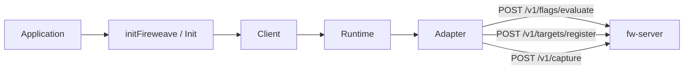

v1 of the Fireweave SDK exposes **exactly two capabilities**: you evaluate [control points](/concepts/control-points), and you [register targets](/concepts/targeting). A **runtime** owns lifecycle and talks to fw-server through an [adapter](/concepts/adapters).

[ADR-0010](https://github.com/FireWeave-HQ/fireweave-sdk/blob/master/docs/adr/0010-control-points-only-v1.md) removed the bundled OpenFeature provider and the `releases`, `exposures`, `signals`, `capabilities`, and `guardrails` client namespaces. Those words still name **platform** ideas. They are not SDK methods.

<Note>
  The wire protocol, Decision envelopes, conformance fixtures, and `capabilities.features.flags` still say `flagKey`. The product name is **control point** ([ADR-0007](https://github.com/FireWeave-HQ/fireweave-sdk/blob/master/docs/adr/0007-control-point-vocabulary.md)). Do not invent `controlPointKey`.
</Note>

## Concept map

<Columns cols={2}>
  <Card title="Control points" href="/concepts/control-points">
    The named decision your code asks Fireweave for. Evaluation uses the parameter `flagKey`.
  </Card>
  <Card title="Targeting" href="/concepts/targeting">
    Who the decision is for: `targetingKey`, properties, and `registerTarget` in every language.
  </Card>
  <Card title="Adapters" href="/concepts/adapters">
    How the runtime talks to a backend: remote, local, or in-memory.
  </Card>
  <Card title="Releases" href="/concepts/releases">
    A platform rollout identity. Not an SDK namespace in v1.
  </Card>
  <Card title="Exposures" href="/concepts/exposures">
    Proof a target saw a decision. Platform concept; no client API in v1.
  </Card>
  <Card title="Signals" href="/concepts/signals">
    Release-safety telemetry. Platform concept; no client API in v1.
  </Card>
  <Card title="Capabilities" href="/concepts/capabilities">
    v1 is two capabilities by construction. The discovery namespace is gone.
  </Card>
  <Card title="OpenFeature" href="/openfeature">
    The bundled provider was retired. An optional bridge package remains possible.
  </Card>
</Columns>

`initFireweave` (Node, Web, Swift), `init_fireweave` (Python, Rust), `fireweave.Init` (Go), and `Fireweave.init` (Java) are the single entry point. `mode` is required: `'remote'` or `'local'`. The SDK never infers it.

## How the pieces fit

| When you… | You use | You do not use |
|-----------|---------|----------------|
| Need a boolean, string, number, or object decision | Evaluate a [control point](/concepts/control-points) | A helper named `fw.isOn` — that API is not in the SDK |
| Need the decision to stick to a person or org | Pass a stable [`targetingKey`](/concepts/targeting) | An SDK-generated anonymous ID — the SDK never invents one |
| Need durable facts (plan, region) on later evaluates | [`registerTarget`](/concepts/targeting) in any of the seven languages | A removed `releases.*` or console ramp method |
| Need a backend for tests vs production | [Adapters](/concepts/adapters) or `mode: 'local'` | `FireweaveProvider` or `makeFireweaveLocalProvider` — both removed |
| Need to know what this SDK can do | Read this page. v1 is control points + target registration | `capabilities.get()` — that namespace is gone |

## Collisions

These names look interchangeable. They are not.

### Control point vs `flagKey`

**Control point** is the product noun: a point of control over a release, not “a boolean.” Evaluation, the HTTP body (`POST /v1/flags/evaluate`), Decision envelopes, conformance fixtures, and `capabilities.features.flags` still use **`flagKey`**. Removing the OpenFeature dependency did not rename that parameter.

Say “control point” in prose. Write `flagKey` in code.

### `client.flags` vs `client.controlPoints`

`client.flags` (Python/Rust: `flags` / `flags()`; Go: `Flags()`; Java: `flags()`) is the **same object** as `controlPoints`. The old name is a deprecated alias. There is no `FW_DEPRECATION_WARNINGS` env gate. Node, Web, Go, Java, Rust, and Swift are silent at runtime (doc-comment only). Python emits one `DeprecationWarning` per process on first access. Use `controlPoints` in new code.

### `targetingKey` vs “cohort key”

`targetingKey` **is** the cohort key. Code always uses `targetingKey`. “Cohort key” is the console synonym for that same stable ID.

### `identify` vs `registerTarget`

Same job on the browser-shaped SDKs. Web and Swift also expose `identify`, which registers the target and re-prefetches under that id. Server SDKs expose `registerTarget` only. This is not OpenFeature identify.

### Guardrails vs the removed stub

The SDK once shipped a typed `guardrails` stub that always returned `UnsupportedCapability`. That stub is gone. Guardrails are a real platform feature in the Fireweave console. The SDK does not evaluate them and has no guardrails API.

## In-app terms that are not SDK APIs

| Term | Status |
|------|--------|
| `fw.isOn` | Absent from every SDK |
| Wrap / ramp as methods | Console / agent workflow. The SDK evaluates; it does not advance a percentage |
| Log / Alert / Block | Console severity scale. Not SDK signal kinds |
| `FireweaveProvider` / `track` | Removed or never implemented. See [OpenFeature](/openfeature) |
| Client `releases` / `exposures` / `signals` / `capabilities` | Removed in v1. See each concept page |

## Related

- [How it works](/introduction/how-it-works) — init, evaluate, register, shut down
- [Architecture](/introduction/architecture) — client → runtime → adapter
- [Quickstart](/quickstart) — first evaluate
- [Migrate 2.1 to 2.3](/migration/v1) — what changed
