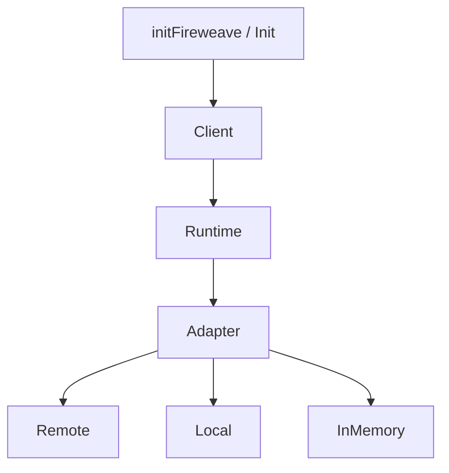

An **adapter** is the evaluate / register / lifecycle backend behind the runtime. `initFireweave` (and each language's equivalent) picks one from `mode`. You can also construct an adapter and pass it to the runtime for tests or custom wiring.

The wire still says `flagKey`. Remote evaluate is `POST /v1/flags/evaluate`.

## Why it exists

Application code should not import a vendor SDK or hold a vendor key. The runtime owns lifecycle, context bounds, and error mapping. The adapter owns HTTP (or fixtures).

## When to use which

| Adapter | Use when |
|---------|----------|
| **Remote** (`FireweaveRemoteAdapter` / `FireweaveRemoteWebAdapter`) | Production. `mode: 'remote'` |
| **Local** (`FireweaveLocalAdapter` / `FireweaveLocalWebAdapter`) | Laptop/dev boolean map. `mode: 'local'` |
| **In-memory** (`InMemoryAdapter` / `InMemoryWebAdapter`) | Unit tests and fixture-driven conformance. Construct it yourself |

There is no PostHog adapter in any language. Node removed it in 2.1. Python, Go, and Java lost the survivors in v1.

## How it relates



| Concept | Relation |
|---------|----------|
| [Runtime](/introduction/architecture) | Owns initialize / READY / shutdown |
| [Control points](/concepts/control-points) | Adapter resolve / evaluate |
| [Targeting](/concepts/targeting) | Remote posts register. Local records and traces. InMemory degrades |

Both modes expose the identical nine methods with identical signatures. A call site must not need to know which mode it is running under.

## Remote

Production HTTP client to **fw-server**. Auth: `Authorization: Bearer <key>`. Server keys use the `project-api-key_…` family. Browser keys use the `fw_public_…` family. Never send `phc_` / `phs_` / `phx_` on this path.

| Path | Purpose |
|------|---------|
| `POST /v1/flags/evaluate` | Batch evaluate, side-effect-free |
| `POST /v1/targets/register` | Durable target properties — all seven remotes |
| `POST /v1/capture` | Capture batch — implemented by the Node and Web remote adapters only. The client has no exposures/signals API; the wire path remains |

`https` is required off-loopback. `http` is loopback only.

Default allowlist (Node, Web, Python, Go, Rust, Swift): `app-server.fireweave.ai`, `staging-app-server.fireweave.ai`, plus loopback. Java's `DEFAULT_ALLOWED_HOSTS` also still lists five legacy PostHog hostnames — a leftover, not a live vendor integration. Self-hosted fw-server hosts must be listed explicitly. `['*']` (Java: `ALLOW_ANY_HOST`) opts out of host pinning; https is still required off-loopback.

The SDK reads **no** environment variables. Pass `apiUrl` / `apiKey` as options. Your application may read `FW_API_URL` / `FW_PROJECT_API_KEY` itself and pass them in.

See [Configuration](/production/configuration).

## Local

`mode: 'local'` builds the local adapter. No network, no credentials.

- Input: a seeded boolean map (`local.controlPoints` / `local.control_points`)
- Key present → mapped boolean, reason `STATIC`
- Key absent → caller default, reason `DEFAULT` (not `FlagNotFound`)
- Boolean-only. Reading an overridden key as string/number → `TypeMismatch`
- `registerTarget` records in-process and emits `[fireweave:local]`. Returns `{ ok: true }`

`mode: 'local'` with credentials supplied is a boot `Configuration` error. The caller means one or the other.

This is **not** in-process secret-key local evaluation. That vendor mode was removed in Node 2.1 and has no replacement.

## In-memory

Deterministic fixture adapter for tests. Present in all seven languages (Java: `ai.fireweave.testing.InMemoryAdapter`; Web: `InMemoryWebAdapter`).

Fixture fields used in tests: `type`, `enabled`, `value`, `variant`, optional `matchAttribute` / `MatchAttributes`.

```ts
import { FireweaveClient, FireweaveRuntime, InMemoryAdapter } from '@fireweaveai/server-sdk';

const adapter = new InMemoryAdapter({
  flags: {
    'new-checkout': {
      type: 'boolean',
      enabled: true,
      value: true,
      variant: 'on',
    },
  },
});
const runtime = new FireweaveRuntime(adapter);
await runtime.initialize();
const client = new FireweaveClient(runtime);
```

**Does not implement `registerTarget`.** Registration degrades with `UnsupportedCapability`. Use local mode when the test needs to assert registration.

InMemory is not the same class as the local adapter. Node reports InMemory `name: 'inmemory'` and Local `name: 'other'`.

## Lower-level construction

`initFireweave` is a thin composition root. Construct the pieces directly for a custom adapter:

```ts
import { FireweaveClient, FireweaveRemoteAdapter, FireweaveRuntime } from '@fireweaveai/server-sdk';

const runtime = new FireweaveRuntime(new FireweaveRemoteAdapter({ apiUrl, apiKey }));
const fireweave = new FireweaveClient(runtime);
await fireweave.initialize();
```

Construct **one** runtime per backend. Share it. Shut it down once. See [Lifecycle](/production/lifecycle).

## Related

- [Architecture](/introduction/architecture) — layers and wire paths
- [Configuration](/production/configuration) — credentials, `mode`, allowlists
- [Testing](/testing) — InMemory fixtures and local mode
