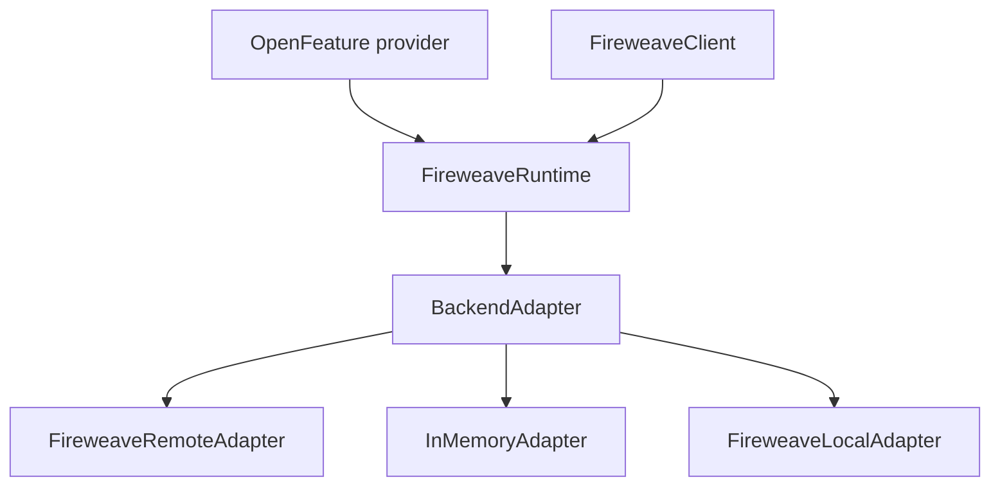

An **adapter** (`BackendAdapter`) is the vendor-neutral evaluate / capture / lifecycle backend behind `FireweaveRuntime`. You construct one adapter, pass it to the runtime, and share that runtime with `FireweaveClient` and (optionally) the OpenFeature provider.

OpenFeature and the wire still say `flagKey`. Remote evaluate is `POST /v1/flags/evaluate`.

## Why it exists

Application code should not import a vendor SDK or hold a vendor key on the intended FireWeave path. The runtime owns lifecycle, context bounds, and error mapping. The adapter owns HTTP (or fixtures).

## When to use which

| Adapter | Use when |
|---------|----------|
| **FireweaveRemoteAdapter** | Production (and any live fw-server). Default network path. |
| **InMemoryAdapter** | Unit tests and the offline [quickstart](/quickstart). No network. |
| **FireweaveLocalAdapter** | Laptop/dev boolean map. Node, Python, Web only. |
| **PostHog adapter** | Escape hatch on **Python** and **Go** only. Removed from Node 2.1. Java is a seam — `create(config)` returns `UnsupportedCapability`. |

## How it relates



| Concept | Relation |
|---------|----------|
| [Runtime](/introduction/architecture) | Owns initialize / READY / shutdown; default shutdown timeout 10_000 ms |
| [Control points](/concepts/control-points) | `adapter.resolve` / evaluate |
| [Targeting](/concepts/targeting) | `registerTarget` only on remote (Node/Python/Web) |
| [Exposures](/concepts/exposures) / [Signals](/concepts/signals) | `POST /v1/capture` on remote |
| [Capabilities](/concepts/capabilities) | `runtime.backend` and feature flags come from the adapter |

## Remote — `FireweaveRemoteAdapter`

Production HTTP client to **fw-server**. Auth: `Authorization: Bearer <project key>`. Current key prefix in the spec: `project-api-key_…`. Never send `phc_` / `phs_` / `phx_` on this path.

| Path | Purpose | Who implements it |
|------|---------|-------------------|
| `POST /v1/flags/evaluate` | Batch evaluate, side-effect-free | All five remotes |
| `POST /v1/capture` | Exposures / signals / events | All five remotes |
| `POST /v1/targets/register` | Durable target properties | Node, Python, Web remotes only |

| Binding | Class | Config |
|---------|-------|--------|
| Node | `FireweaveRemoteAdapter` | `apiUrl` / `apiKey` or `FW_API_URL` / `FW_PROJECT_API_KEY`. `requestTimeoutMs` 3000, `shutdownTimeoutMs` 10000 |
| Python | `FireweaveRemoteAdapter` | Same env vars when options omitted |
| Go | `adapters/remote` | `APIURL` / `APIKey` or those env vars. `RequestTimeout` 3s, `CloseTimeout` 10s |
| Java | `FireweaveRemoteAdapter` | `FireweaveConfig` / constructor **only**. **No `System.getenv`.** Javadoc *maps* `host` / `projectApiKey` to the env names for documentation |
| Web | `FireweaveRemoteWebAdapter` | **`apiUrl` and `apiKey` required.** No env. Rejects `phc_` / `phs_` / `phx_` shapes |

`https` is required off-loopback; `http` is loopback only.

Host allowlists differ: Node/Web default to FireWeave hosts + loopback (`app-server.fireweave.ai`, `staging-app-server.fireweave.ai`, localhost). Python/Go/Java defaults include PostHog hosts + loopback. Whether `app-server.fireweave.ai` is the customer-facing URL is **NEEDS VERIFICATION**.

```ts
const adapter = new FireweaveRemoteAdapter({
  apiUrl: process.env.FW_API_URL,
  apiKey: process.env.FW_PROJECT_API_KEY,
  requestTimeoutMs: 3000,
});
const runtime = new FireweaveRuntime(adapter);
const client = new FireweaveClient(runtime);
await client.initialize();
```

See [Configuration](/production/configuration) for auth and allowlists.

## In-memory — `InMemoryAdapter`

Deterministic fixture adapter for tests and offline quickstarts. Present in all five languages (Java: `ai.fireweave.testing.InMemoryAdapter`; Web: `InMemoryWebAdapter`).

Fixture fields used in tests and SDK docs: `type`, `enabled`, `value`, `variant`, optional `matchAttribute` / `MatchAttributes`, payload, metadata.

```ts
const adapter = new InMemoryAdapter({
  flags: {
    'new-checkout': {
      type: 'boolean',
      enabled: true,
      value: true,
      variant: 'on',
    },
  },
});
```

Node also accepts `fault`, `initError`, `initGate`, and `setFlags()` for live mutation.

**Does not implement `registerTarget`.** Registration returns `UnsupportedCapability` so a harness cannot look registered when it is not.

InMemory is not the same class as the local/dev adapter. Node reports InMemory `name: 'inmemory'` and Local `name: 'other'`.

## Local / dev — Node, Python, Web only

`FireweaveLocalAdapter` / `FireweaveLocalWebAdapter` plus `makeFireweaveLocalProvider()` / `make_fireweave_local_provider()`.

- Input: `devFlags: Record<string, boolean>` (Python equivalent)
- Key present → mapped boolean, reason `STATIC`
- Key absent → caller default (`FLAG_NOT_FOUND` rewritten to `DEFAULT` on the local **provider** only)
- Boolean-only. Reading an overridden key as string/number → `TypeMismatch`
- No network, no credentials, no exposure sink (`exposureEmission: false`)

**Absent** in Go and Java on `master`.

This is **not** Node in-process secret-key local evaluation. That mode was removed in tree 2.1. Both shipped Node adapters report `localEvaluation: false` on the remote path; the Local adapter reports `localEvaluation: true` because it resolves in-process from `devFlags`.

## PostHog extra (language-gated)

| Language | Status |
|----------|--------|
| Node 2.1 | **Removed.** No `./posthog`, no `PostHogAdapter`, no `posthog-node` peer |
| Python | `from fireweave.adapters.posthog import PostHogAdapter` — extra `fireweave[posthog]` |
| Go | package `adapters/posthog` |
| Java | `PostHogAdapter.create(config)` → `UnsupportedCapability` until a Java server SDK exists |
| Web | None |

Do not document Node `PostHogAdapter` except on the [2.0 → 2.1 migration](/migration/node-2) page.

## Runtime relationship

Construct **one** runtime per backend. Share it.

1. Create an adapter
2. `new FireweaveRuntime(adapter)` (or language equivalent)
3. `initialize` and wait for READY (Web may enter **STALE** if prefetch loses a 5s ceiling)
4. Pass the runtime into `FireweaveClient` and/or `FireweaveProvider`
5. `shutdown` once — [flush rules](/concepts/exposures#shutdown) differ on Java

Lifecycle states: `UNINITIALIZED` \| `INITIALIZING` \| `READY` \| `STALE` \| `ERROR` \| `FATAL` \| `SHUTDOWN`. Details: [Lifecycle](/production/lifecycle).

## Related

- [Architecture](/introduction/architecture) — layers and wire paths
- [Configuration](/production/configuration) — env vars, Java/Web exceptions
- [Testing](/testing) — InMemory fixtures
- [Compatibility](/sdks/compatibility) — adapter matrix
