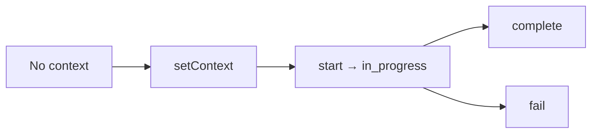

A **release** is the SDK’s record that this process is serving a rollout. You bind a `ReleaseContext`, then report lifecycle transitions.

It is a FireWeave **extension** on `FireweaveClient`. It is not the in-app rollout workflow (Registered / Ramping / Verifying / Completed / Rolled back). Do not document those console states as SDK APIs.

OpenFeature and the wire still say `flagKey` for evaluations. Release identity uses `rolloutId`, optional `changeId`, and `stampIds`.

## Why it exists

Deploy-attestation (“boot beacon”) semantics are `setContext` + `start`: this process declares which rollout and stamps it is running. `complete` and `fail` close that attestation. Evaluation does not require a bound release; correlation fields on [signals](/concepts/signals) and [exposures](/concepts/exposures) are optional.

## When to use it

Call this when your service knows the rollout it is serving and you want the SDK to record that lifecycle:

1. `setContext` — once you have IDs
2. `start` — process is up and serving
3. `complete` or `fail` — terminal transition

Skip it for unit tests that only evaluate fixtures.

## How it relates

| Concept | Relation |
|---------|----------|
| [Signals](/concepts/signals) | Node `complete` / `fail` also record an outcome signal (`name: 'release'`). `recordOutcome` is a separate call you can make anytime |
| [Exposures](/concepts/exposures) | Optional `rolloutId` correlation on a record |
| [Capabilities](/concepts/capabilities) | `releases.setContext` / `start` / `complete` / `fail` appear in the operation list |
| Console “ramp” | Operator workflow. The SDK does not advance percentages |

## SDK lifecycle (not the console)

Statuses the **clients** actually store:

| Status | Meaning in the SDK |
|--------|--------------------|
| Context set / unset | `setContext` succeeded (Node status `'set'`; Go `ReleaseStatusUnset` until `Start`) |
| `in_progress` | After `start` |
| `completed` | After `complete` |
| `failed` | After `fail` |



<Warning>
  Do not map these onto console **Registered / Ramping / Verifying / Rolled back**. Those names are not SDK APIs. Whether the console consumes these transitions is **NEEDS VERIFICATION**.
</Warning>

## IDs

Validation matches `spec/release-context.schema.json`. Clients enforce this set — they do not require extra fields.

| Field | Required | Rule |
|-------|----------|------|
| `rolloutId` | **Yes** | 1–128 characters. No `rollout_` prefix is required by the schema. |
| `stampIds` | **Yes** | 1–64 **unique** values matching `stmp_` + 26 Crockford ULID chars (`0-9A-HJKMNP-TV-Z`, no I, L, O, U) |
| `changeId` | No | If present: `chg_` + 26 Crockford chars |

Optional `surfaces[].surfaceId` in the schema uses `sfc_` + 26 Crockford chars. That field is **not** required by `setContext`. Do not treat `sfc_` as a required SDK identifier.

Failure `reason` strings are secret-redacted (`phc_` / `phs_` / `phx_`, bearer tokens → `[REDACTED]`) before storage or emission.

## API

Extension calls **degrade instead of throwing** (except Go, which returns `error`). Before `READY` they fail with `NotReady` / `UnsupportedCapability`; after shutdown, `AlreadyClosed`.

| Language | Bind | Start | Complete | Fail | Returns |
|----------|------|-------|----------|------|---------|
| Node | `releases.setContext({ rolloutId, stampIds, changeId? })` | `start({ rolloutId? })` | `complete({ rolloutId? })` | `fail({ rolloutId?, reason? })` | Result object (`ok`, `status`, …). `complete` / `fail` also `signals.record` an outcome |
| Python | `releases.set_context(rollout_id, change_id=None, stamp_ids=())` | `start(rollout_id=None)` | `complete(...)` | `fail(..., reason=None)` | `ReleaseResult` |
| Go | `Releases().SetContext(ctx, rc)` | `Start(ctx, rolloutID)` | `Complete(ctx, rolloutID)` | `Fail(ctx, rolloutID, reason)` | `error`. Transitions name the rollout explicitly |
| Java | `releases().setContext(ReleaseContext)` | `start(rolloutId)` | `complete(rolloutId)` | `fail(rolloutId, reason)` | `ExtensionResult` |
| Web | `WebReleasesApi` — same four operations | same | same | same | Result objects |

Go (and Java via the adapter seam) can emit `$fw_release_<status>` to a telemetry sink when one is attached. Node/Python may record some paths in-process only.

<Note>
  Delivery of release events all the way to fw-server is **NEEDS VERIFICATION** (compatibility known gap). Do not write “releases always reach the server.”
</Note>

## What it looks like

<Tabs>
  <Tab title="Node">
    ```ts
    const ctx = {
      rolloutId: 'rollout_01HZXEXAMPLE000000000001',
      changeId: 'chg_01HZXEXAMPLE0000000000001',
      stampIds: ['stmp_01HZXEXAMPLE000000000001'],
    };

    client.releases.setContext(ctx);
    client.releases.start();                       // { ok, status: 'in_progress' }
    client.releases.complete();                    // also records an outcome signal
    // or: client.releases.fail({ reason: 'canary regression' });
    ```
  </Tab>
  <Tab title="Python">
    ```python
    client.releases.set_context(
        "rollout_01HZXEXAMPLE000000000001",
        change_id="chg_01HZXEXAMPLE0000000000001",
        stamp_ids=["stmp_01HZXEXAMPLE000000000001"],
    )
    client.releases.start()
    client.releases.complete()
    # or: client.releases.fail(reason="canary regression")
    ```
  </Tab>
  <Tab title="Go">
    ```go
    rc := fireweave.ReleaseContext{
        RolloutID: "rollout_01HZXEXAMPLE000000000001",
        ChangeID:  "chg_01HZXEXAMPLE0000000000001",
        StampIDs:  []string{"stmp_01HZXEXAMPLE000000000001"},
    }
    if err := client.Releases().SetContext(ctx, rc); err != nil { /* handle */ }
    if err := client.Releases().Start(ctx, rc.RolloutID); err != nil { /* handle */ }
    if err := client.Releases().Complete(ctx, rc.RolloutID); err != nil { /* handle */ }
    // or: client.Releases().Fail(ctx, rc.RolloutID, "canary regression")
    ```
  </Tab>
  <Tab title="Java">
    ```java
    client.releases().setContext(ReleaseContext.builder()
        .rolloutId("rollout_01HZXEXAMPLE000000000001")
        .changeId("chg_01HZXEXAMPLE0000000000001")
        .stampId("stmp_01HZXEXAMPLE000000000001")
        .build());
    client.releases().start("rollout_01HZXEXAMPLE000000000001");
    client.releases().complete("rollout_01HZXEXAMPLE000000000001");
    // or: client.releases().fail("rollout_01HZXEXAMPLE000000000001", "canary regression");
    ```
  </Tab>
</Tabs>

## Related

- [Signals](/concepts/signals) — `recordOutcome` vs `releases.complete`
- [Capabilities](/concepts/capabilities) — discover `releases.*`
- [Lifecycle](/production/lifecycle) — READY before extension calls
