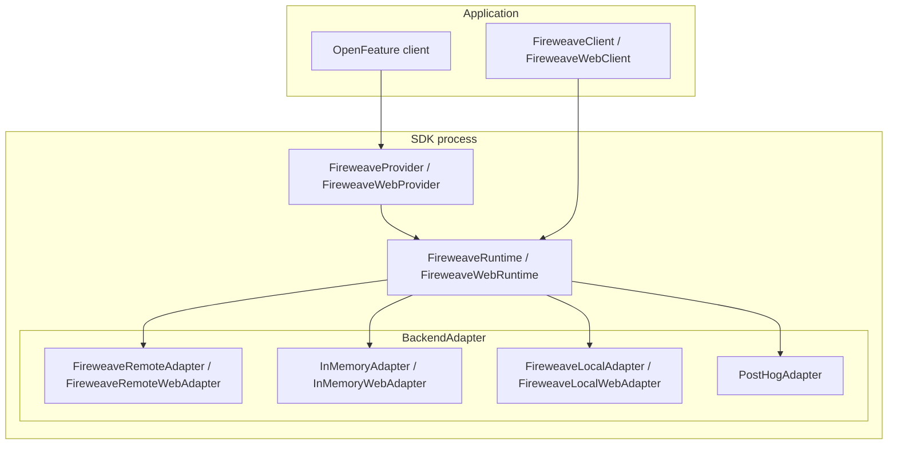
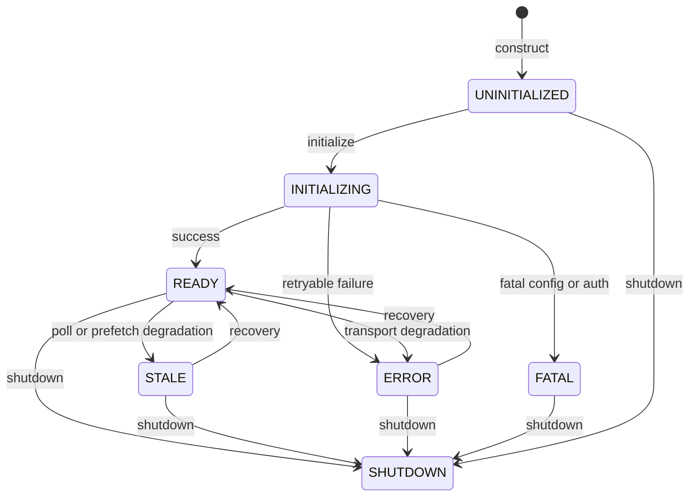

Every language follows the same pattern: **FireweaveProvider** (OpenFeature) and **FireweaveClient** (native evaluation + extensions) share a **FireweaveRuntime**, which owns lifecycle, config, and a **BackendAdapter**.

| Layer | Responsibility |
| --- | --- |
| OpenFeature client | Spec evaluation API (`flagKey`, typed getters, hooks, domains). Never-throw getters. |
| `FireweaveProvider` / `FireweaveWebProvider` | OF `FeatureProvider`. Maps context and errors. Delegates to the runtime. |
| `FireweaveClient` / `FireweaveWebClient` | Native evaluate plus releases, exposures, signals, capabilities, and (where implemented) targets. |
| `FireweaveRuntime` / `FireweaveWebRuntime` | Lifecycle, config, adapter ownership, exposure policy, Decision construction. |
| `BackendAdapter` | Evaluate / capture / lifecycle against a backend. Production default is the FireWeave remote adapter (ADR-0005). |

Web types are the browser package (`@fireweaveai/web-sdk`). Server packages use the non-`Web` names. Go’s runtime type is `fireweave.Runtime`; its OpenFeature constructor is `openfeature.NewProvider(client)`.

<Note>
  Older SDK architecture sketches show `phc_` keys, `exposurePolicy.defaultSend: true`, and `adapter("posthog")` construction. Those are stale. Production credentials are a FireWeave project key (`project-api-key_…`). `sendExposure` defaults **false**. Construct a concrete adapter class; do not pass a string adapter name.
</Note>

## Adapters

| Adapter | When to use | Node 2.1 | Python | Go | Java | Web |
| --- | --- | --- | --- | --- | --- | --- |
| `FireweaveRemoteAdapter` | Production fw-server | yes | yes | `adapters/remote` | yes | `FireweaveRemoteWebAdapter` |
| `InMemoryAdapter` | Tests and offline quickstart | yes | yes | `adapters/inmemory` | `ai.fireweave.testing` | `InMemoryWebAdapter` |
| Local / dev boolean map | Local flags without fw-server | `FireweaveLocalAdapter` | `FireweaveLocalAdapter` | — | — | `FireweaveLocalWebAdapter` |
| Direct PostHog | Escape hatch | removed | `fireweave[posthog]` | `adapters/posthog` | seam only | — |

Remote adapters authenticate with `Authorization: Bearer <key>`. Node, Python, and Go remote adapters read `FW_API_URL` and `FW_PROJECT_API_KEY` when options are omitted. Java takes `FireweaveConfig.host` / `projectApiKey` only — **no `System.getenv`**. Web requires constructor `apiUrl` and `apiKey` — **no environment**.

`https` is required off-loopback; `http` is loopback-only. Host allowlists differ: Node/Web default to FireWeave hosts + loopback (plus the configured hostname); Python/Go/Java defaults include PostHog hosts + loopback (Java in particular will reject an unknown fw-server host unless you set `allowedHosts`).

Never send PostHog `phc_` / `phs_` / `phx_` keys on the FireWeave remote path. The web adapter rejects those shapes.

## Evaluation path

1. The OpenFeature client or `FireweaveClient` supplies `flagKey`, expected type, default, and context (`targetingKey` + attributes).
2. The provider (if used) maps OF context to the canonical evaluation context. Reserved `fireweave.*` keys other than `fireweave.groups` / `fireweave.groupProperties` yield `InvalidContext`.
3. The runtime checks lifecycle. Not ready or already closed → default + `NotReady` / `AlreadyClosed`.
4. The adapter evaluates (`evaluateFlags` / language equivalent). Remote: `POST /v1/flags/evaluate` (side-effect-free).
5. The runtime coerces the typed value or returns `TypeMismatch` + default.
6. A **Decision** is built (`flagKey`, `value`, `variant`, `reason`, error fields, metadata).
7. OpenFeature maps that to `ResolutionDetails`. Native callers get the Decision (or a typed getter that reads `value`).
8. Exposure emission runs only when `sendExposure` is true (default **false**) or you call `exposures.record`.

Web evaluation is a **synchronous cache read** (`evaluateSync`). `initialize` / `identify` / `setContext` prefetch asynchronously. A prefetch that exceeds `DEFAULT_FLAGS_READY_TIMEOUT_MS` (5000) leaves the runtime **STALE**.

## Lifecycle states

Verified states: `UNINITIALIZED` | `INITIALIZING` | `READY` | `STALE` | `ERROR` | `FATAL` | `SHUTDOWN`.

OpenFeature status mapping used by the SDKs: UNINITIALIZED / INITIALIZING / SHUTDOWN → `NOT_READY`; READY → `READY`; STALE → `STALE`; ERROR → `ERROR`; FATAL → `FATAL`.

Default shutdown timeout is 10_000 ms. Node, Python, and Web client `shutdown` flush exposures first. Java `close()` and `runtime.shutdown()` **do not**.

## Wire protocol

Spec version `0.1.0`. Paths implemented by remote adapters:

| Method | Path | Purpose | Who implements it |
| --- | --- | --- | --- |
| `POST` | `/v1/flags/evaluate` | Batch evaluation (side-effect-free) | All five remote adapters |
| `POST` | `/v1/capture` | Exposures, signals, events | All five remote adapters |
| `POST` | `/v1/targets/register` | Durable target properties | Node, Python, Web only |

Auth on the wire: `Authorization: Bearer <FireWeave project/runtime key>`. The spec also accepts `x-api-key`; do not document that header as universally sent by every adapter.

Evaluate request fields include `targetingKey`, `attributes`, `groups`, `groupProperties`, `flagKeys`. Register body: `targetingKey`, `kind`, `environment`, `properties`. Response shape: `{ "ok": true, "targetingKey": "…" }`.

<Note>
  Production hostnames such as `app-server.fireweave.ai` appear on the Node/Web allowlist. Whether they are the customer-facing fw-server URL is **not verified** from the SDK repo. Configure `FW_API_URL` / `apiUrl` / Java `host` from your project, and add that hostname to Java `allowedHosts` if it is not already listed.
</Note>

There is no customer OpenAPI artifact in this docs repo. Do not treat the table above as a REST playground.

## OpenFeature boundary

FireWeave ships a provider in all five packages (OF spec floor **v0.8.0**, ADR-0003). Pins:

| Binding | Provider | OF SDK |
| --- | --- | --- |
| Node | `FireweaveProvider` | `@openfeature/server-sdk` ^1.22.0 (peer) |
| Python | `fireweave.openfeature.FireweaveProvider` | `openfeature-sdk` `>=0.10,<0.11` (extra) |
| Go | `openfeature.NewProvider` | `go-sdk` v1.17.2 |
| Java | `ai.fireweave.openfeature.FireweaveProvider` | `dev.openfeature:sdk` **1.15.1** |
| Web | `FireweaveWebProvider` | `@openfeature/web-sdk` ^1.9.0 (peer); sync resolvers; metadata name `fireweave-web`; `runsOn = 'client'` |

Tracking (OpenFeature spec §6) is **not implemented**. Releases, exposures, signals, targets, and capabilities live on `FireweaveClient`.

## Packages

| Language | Package |
| --- | --- |
| Node / Bun / Deno | `@fireweaveai/sdk` |
| Python | `fireweave` |
| Go | `github.com/FireWeave-HQ/fireweave-sdk/sdks/go` |
| Java | `ai.fireweave:fireweave-sdk` (plus `fireweave-openfeature`, `fireweave-testing`, `fireweave-adapter-posthog`) |
| Browser | `@fireweaveai/web-sdk` |

See [Compatibility](/sdks/compatibility) for the type and adapter matrix, and [Package index](/reference/packages) for publish state.
