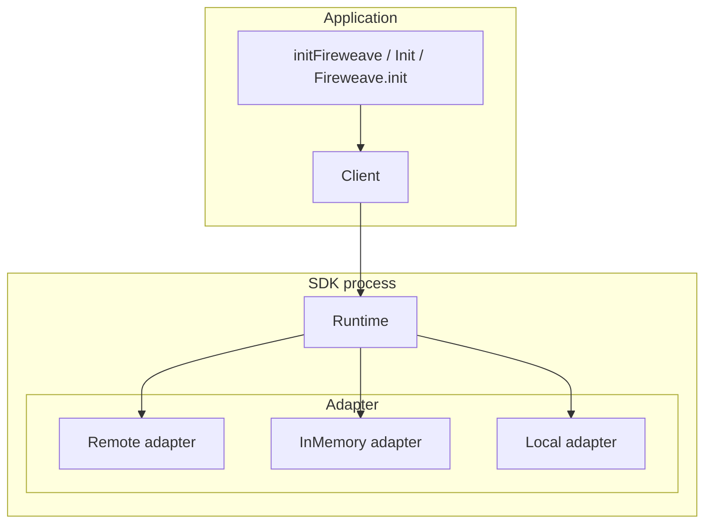
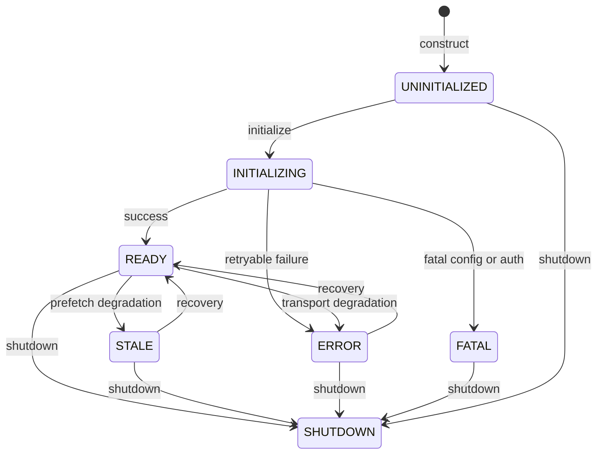

Every language follows the same pattern: **`initFireweave` / `Init` / `Fireweave.init`** is the composition root. It validates `mode`, constructs one **adapter**, wraps it in a **runtime**, and returns a **client**. The client exposes `controlPoints` and `registerTarget`. Nothing downstream branches on mode again.

| Layer | Responsibility |
| --- | --- |
| `initFireweave` / `Init` / `Fireweave.init` | The only module allowed to import concrete adapters. Validates `mode` and credentials. |
| Client (`FireweaveClient` / `FireweaveWebClient`) | `controlPoints` (nine methods) and `registerTarget`. Web and Swift also have `identify`. |
| Runtime | Lifecycle, config, adapter ownership, Decision construction. Evaluation never throws. |
| Adapter | Evaluate / register / lifecycle against a backend. Production default is the Fireweave remote adapter. |

Web types are the browser package (`@fireweaveai/web-sdk`). Server packages use the non-`Web` names. Go's runtime type is `fireweave.Runtime`; its entry point is `fireweave.Init`.

<Note>
  Older architecture sketches show `FireweaveProvider`, `phc_` keys, `exposurePolicy.defaultSend: true`, and `adapter("posthog")` construction. Those are stale. Production credentials are a Fireweave project key (`project-api-key_…`) or a browser `fw_public_…` key. Construct a concrete adapter, or let `initFireweave` do it.
</Note>

## Adapters

| Adapter | When to use | All seven languages |
| --- | --- | --- |
| Remote | Production fw-server | yes (`FireweaveRemoteWebAdapter` on web) |
| Local | Seeded boolean map, no network | yes (`mode: 'local'`) |
| In-memory | Tests and offline fixtures | yes (Java: `ai.fireweave.testing`) |

Remote adapters authenticate with `Authorization: Bearer <key>`. The SDK reads no environment. Pass `apiUrl` and `apiKey`.

`https` is required off-loopback; `http` is loopback-only. Default allowlists name Fireweave hosts + loopback. Java's list also still carries leftover PostHog hostnames — not a live vendor integration.

Never send PostHog `phc_` / `phs_` / `phx_` keys on the Fireweave remote path. The web adapter rejects those shapes.

## Evaluation path

1. The client supplies `flagKey`, expected type, default, and context (`targetingKey` + attributes).
2. The runtime validates key, default-vs-type, context, then lifecycle — before any I/O.
3. Not ready or already closed → default + `NotReady` / `AlreadyClosed`.
4. The adapter evaluates. Remote: `POST /v1/flags/evaluate` (side-effect-free).
5. The runtime coerces the typed value or returns `TypeMismatch` + default.
6. A **Decision** is built (`flagKey`, `value`, `variant`, `reason`, error fields, metadata).

Web and Swift evaluation is a **synchronous cache read**. `initFireweave` / `identify` / `setContext` prefetch asynchronously. A prefetch that exceeds `DEFAULT_FLAGS_READY_TIMEOUT_MS` (5000) leaves the runtime **STALE**.

## Lifecycle states

Verified states: `UNINITIALIZED` | `INITIALIZING` | `READY` | `STALE` | `ERROR` | `FATAL` | `SHUTDOWN`.

Default shutdown timeout is 10_000 ms. See [Lifecycle](/production/lifecycle).

## Wire protocol

Spec version `0.1.0`. Paths implemented by remote adapters:

| Method | Path | Purpose | Who implements it |
| --- | --- | --- | --- |
| `POST` | `/v1/flags/evaluate` | Batch evaluation (side-effect-free) | All seven remotes |
| `POST` | `/v1/capture` | Capture batch | Node and Web remote adapters only. The client has no exposures/signals API |
| `POST` | `/v1/targets/register` | Durable target properties | All seven remotes |

Auth on the wire: `Authorization: Bearer <key>`. The spec also accepts `x-api-key`; shipped adapters send Bearer.

Evaluate request fields include `targetingKey`, `attributes`, `groups`, `groupProperties`, `flagKeys`. Register body: `targetingKey`, `kind`, `environment`, `properties`.

The test-server stub implements evaluate, capture, and `/health`. It does **not** implement `/v1/targets/register`.

There is no customer OpenAPI artifact in this docs repo. See [HTTP API](/reference/http-api) if that page is present.

## Packages

| Language | Package |
| --- | --- |
| Node / Bun / Deno | `@fireweaveai/server-sdk` |
| Browser | `@fireweaveai/web-sdk` |
| Python | `fireweave` |
| Go | `github.com/FireWeave-HQ/fireweave-sdk/sdks/go/v2` |
| Java | `ai.fireweave:fireweave-sdk` (plus unpublished `fireweave-testing`) |
| Rust | `fireweave` |
| Swift | `Fireweave` |

See [Compatibility](/sdks/compatibility) and [Package index](/reference/packages).
