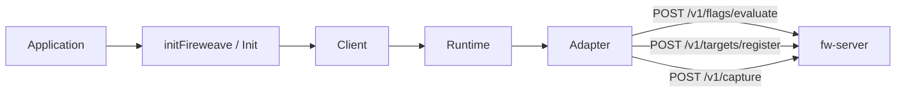

A Fireweave integration is one **client**, built by `initFireweave` (or the language equivalent), sitting on one **runtime** and one **adapter**. You evaluate [control points](/concepts/control-points) and [register targets](/concepts/targeting). That is the whole v1 surface.

The runtime never invents an identity (you pass `targetingKey`) and evaluation **never throws** — failures come back as a Decision carrying your default.

The wire still says `flagKey`. The product noun is **control point**.

There is no OpenFeature provider in this picture. See [OpenFeature](/openfeature).

## 1. Init with a required mode

`mode` is `'remote'` or `'local'` and is never inferred. Remote without credentials is a boot error.

| Mode | Adapter | Languages |
| --- | --- | --- |
| `remote` | `FireweaveRemoteAdapter` / `FireweaveRemoteWebAdapter` | All seven |
| `local` | `FireweaveLocalAdapter` / `FireweaveLocalWebAdapter` | All seven |

Construct `InMemoryAdapter` yourself for fixture-driven tests. See [Adapters](/concepts/adapters).

The SDK reads no environment variables. Your application may read `FW_API_URL` / `FW_PROJECT_API_KEY` and pass them in.

## 2. Initialize, then wait for a usable state

`initFireweave` / `Init` / `Fireweave.init` validates options, constructs the adapter, and brings the runtime to `READY` — or throws `Configuration`.

Reads before READY degrade to your default with `NotReady`.

The browser-shaped runtimes (Web, Swift) add a load-bearing **STALE** state: if the initial prefetch loses a 5 second ceiling, sync reads return defaults with reason `STALE`. That is not the same as READY with every control point off. See [Lifecycle](/production/lifecycle).

## 3. Register a target

A **target** is who the decision is for, keyed by `targetingKey`.

Register durable properties once (login / device provision). `registerTarget` exists in **all seven** languages and **never throws** — check `ok`.

- Server SDKs: `registerTarget` / `register_target` / `RegisterTarget`
- Web and Swift: `registerTarget`, plus `identify` (register, then re-prefetch under that id)

Options include `kind` (`user` | `device`) and `properties`. `fw_`-prefixed property keys are reserved and stripped server-side.

Two identity paths compose on fw-server: stored `registerTarget` properties, plus per-evaluate attributes (attributes win for that call). Local mode records in-process and traces `[fireweave:local]`. In-memory adapters and the repo test-server stub do not persist registration.

## 4. Evaluate a control point

The nine methods live on `controlPoints` / `control_points` / `ControlPoints`:

| Language | Namespace | Read |
| --- | --- | --- |
| Node | `client.controlPoints` | async |
| Web | `client.controlPoints` | **synchronous** |
| Python | `client.control_points` | sync |
| Go | `client.ControlPoints()` | sync |
| Java | `client.controlPoints()` | sync |
| Rust | `client.control_points` | sync |
| Swift | `client.controlPoints` | **synchronous** |

The argument is still `flagKey`. Every evaluation produces a **Decision**: `flagKey`, `value` (or your default), optional `variant`, `reason`, and error fields. If the value looks like your default, inspect `reason` / the error kind.

A v1 read is side-effect free. No read emits telemetry as a consequence of being called.

## 5. Shut down once

Share one client. Shut it down once at process exit. Default bound is 10_000 ms where the language exposes it.

- Node / Web / Python / Rust / Swift: `shutdown()`
- Java: `close()`
- Go: `client.Runtime().Shutdown(ctx)`

## What this flow is not

The SDK evaluates and registers targets. It does not wrap application code, advance a percentage ramp, or run client-side guardrails. The `releases`, `exposures`, `signals`, `capabilities`, and `guardrails` client namespaces are gone. Console wrap / ramp / Log-Alert-Block language is not part of this path.

Next: [Architecture](/introduction/architecture) for layers and wire paths, or [Quickstart](/quickstart) to run an offline evaluate.
