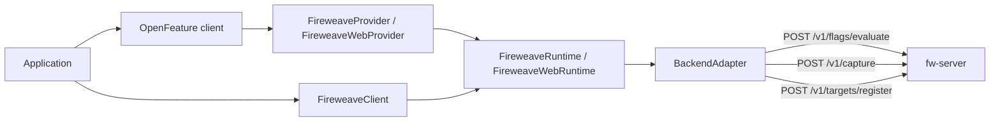

A FireWeave integration is one **runtime**, one **adapter**, and two public faces: **FireweaveClient** (native control points and extensions) and **FireweaveProvider** (OpenFeature). Both call the same `FireweaveRuntime`. The runtime never invents an identity (you pass `targetingKey`) and evaluation **never throws** — failures come back as a Decision carrying your default.

OpenFeature and the HTTP body still say `flagKey`. The product noun is **control point**.

`POST /v1/targets/register` is implemented on the Node, Python, and Web remote adapters only. Go and Java remote adapters speak evaluate and capture.

## 1. Construct a runtime on an adapter

| Adapter | Role | Languages |
| --- | --- | --- |
| `FireweaveRemoteAdapter` / `FireweaveRemoteWebAdapter` | Production HTTP to fw-server | All five |
| `InMemoryAdapter` / `InMemoryWebAdapter` | Deterministic fixtures; no network | All five (Java: `ai.fireweave.testing`) |
| `FireweaveLocalAdapter` / `FireweaveLocalWebAdapter` | Dev boolean map | Node, Python, Web |
| `PostHogAdapter` | Direct-vendor escape hatch | Python extra, Go package; Java seam only (`UnsupportedCapability` from `create(config)`) |

Node 2.1 has no PostHog adapter. In-memory and local adapters do **not** persist target registration — they report `UnsupportedCapability`.

## 2. Initialize, then wait for a usable state

`initialize` moves the runtime through `UNINITIALIZED` → `INITIALIZING` → `READY` (or `FATAL` / `ERROR` on failure). Reads before READY degrade to your default with `NotReady`.

The browser runtime adds a load-bearing **STALE** state: if the initial prefetch loses a 5 second ceiling, sync reads return defaults with reason `STALE`. That is not the same as READY with every control point off. See [Architecture](/introduction/architecture) and [Lifecycle](/production/lifecycle).

<Tip>
  Node's OpenFeature provider defaults `lazyReady` to **true**. If you use `OpenFeature.setProviderAndWait`, pass `{ lazyReady: false }` when you need READY before the first read. Native `FireweaveClient.initialize()` is explicit.
</Tip>

## 3. Optionally register a target

A **target** is who the decision is for, keyed by `targetingKey` (the OpenFeature field; the console synonym is “cohort key”).

Where the API exists, register durable properties once (login / device provision):

- Node: `runtime.registerTarget(targetingKey, options?)` → `{ ok, error? }`, **never throws**
- Python: `runtime.register_target(targeting_key, options?)`
- Web: `client.identify(targetingKey, options?)` → `registerTarget`, then `setContext({ targetingKey })`

Options include `kind` (`user` | `device`) and `properties`. `fw_`-prefixed property keys are reserved and stripped server-side.

Go and Java have **no** registration API on `master`. Pass `targetingKey` and per-request `attributes` on evaluate.

Two identity paths compose on fw-server: stored `registerTarget` properties, plus per-evaluate `attributes` (attributes win for that call). In-memory adapters and the repo test-server stub do not persist registration.

## 4. Evaluate a control point

Native surfaces (language-specific names):

| Language | Call |
| --- | --- |
| Node / Web | `client.controlPoints.getBooleanValue` / `evaluate` (Web is **synchronous**) |
| Python | `client.control_points.get_boolean_value` / `evaluate` |
| Go | `client.Flags().Evaluate` only — no typed getters, no `controlPoints` |
| Java | `client.getBooleanValue` / `getStringValue`, or `evaluate` for other types |

You can instead call OpenFeature `getBooleanValue` (and typed siblings) through the provider. The argument is still `flagKey`. FireWeave extensions (releases, exposures, signals, targets, capabilities) stay on `FireweaveClient` — they are not OpenFeature methods.

Every evaluation produces a **Decision**: `flagKey`, `value` (or your default), optional `variant`, `reason`, and error fields. Documented reasons include `TARGETING_MATCH`, `SPLIT`, `DISABLED`, `STALE`, and `ERROR`. If the value looks like your default, inspect `reason` / `errorCode`.

`sendExposure` / `send_exposure` / `SendExposure` defaults **false**. Phase-one OpenFeature evaluate is side-effect-free. Recording assignment is a separate step.

## 5. Record what happened

| Extension | API | Wire |
| --- | --- | --- |
| Exposure | `exposures.record` / `flush` | `POST /v1/capture` with `type: "exposure"` |
| Signal | `recordHealth` / `recordError` / `recordMetric` / `recordOutcome` | `POST /v1/capture` with `type: "signal"` |
| Release | `releases.setContext` / `start` / `complete` / `fail` | Client lifecycle; delivery to fw-server is adapter-dependent |

An **outcome** signal (`recordOutcome`) is telemetry (name + status). Completing a release is a different call (`releases.complete`). Do not collapse them into one API.

Signal attributes pass an allowlist (Node’s default list includes `name`, `kind`, `status`, `value`, `unit`, `rolloutId`, `changeId`, `stampId`, `errorKind`, `message`, `flagKey`, `variant`, `environment`, `service`). Messages are secret-redacted.

<Warning>
  Do not assume every language delivers every signal and release transition to fw-server. Compatibility notes a sink skew (Go/Java vs Node/Python in-process paths). Confirm on [Signals](/concepts/signals) and [Releases](/concepts/releases) before treating delivery as guaranteed.
</Warning>

## 6. Shut down once

Share one runtime. Shut it down once at process exit:

- Node / Python / Web: `client.shutdown()` flushes exposures first
- Go: `Exposures().Flush(ctx)` then `runtime.Shutdown(ctx)`
- Java: `exposures().flush()` then `close()` — **`close()` / `runtime.shutdown()` do not flush**

Default shutdown bound is 10_000 ms where the language exposes it.

## What this flow is not

The SDK evaluates and reports. It does not wrap application code, advance a percentage ramp, or run client-side guardrails (`guardrails.evaluate` is an `UnsupportedCapability` stub). Console wrap / ramp / Log-Alert-Block language is not part of this path.

Next: [Architecture](/introduction/architecture) for layers and wire paths, or [Quickstart](/quickstart) to run an offline evaluate.
